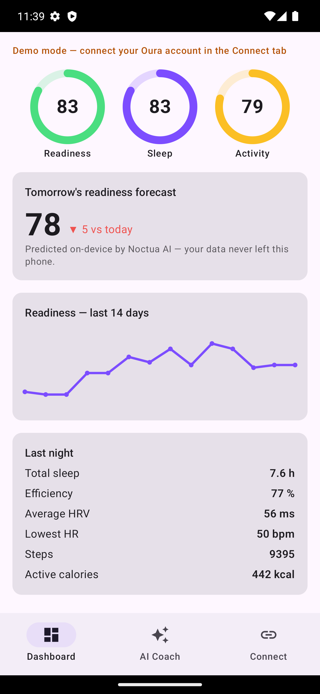
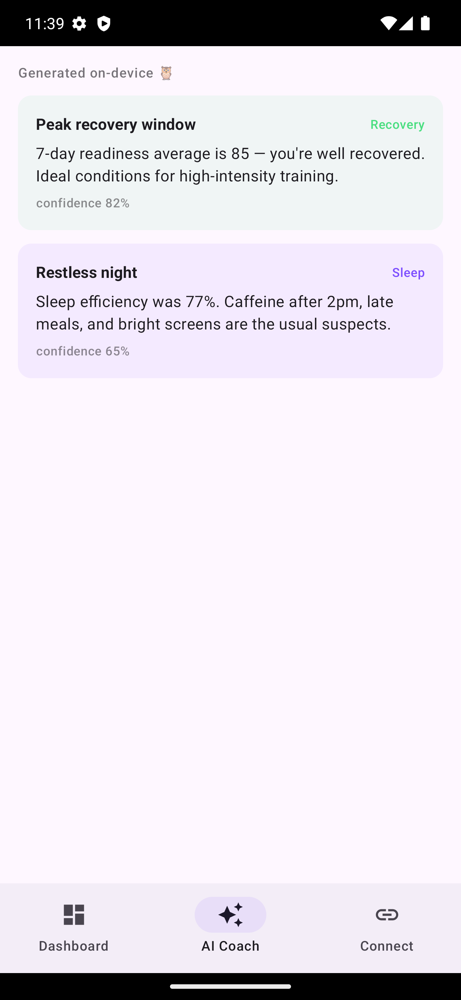
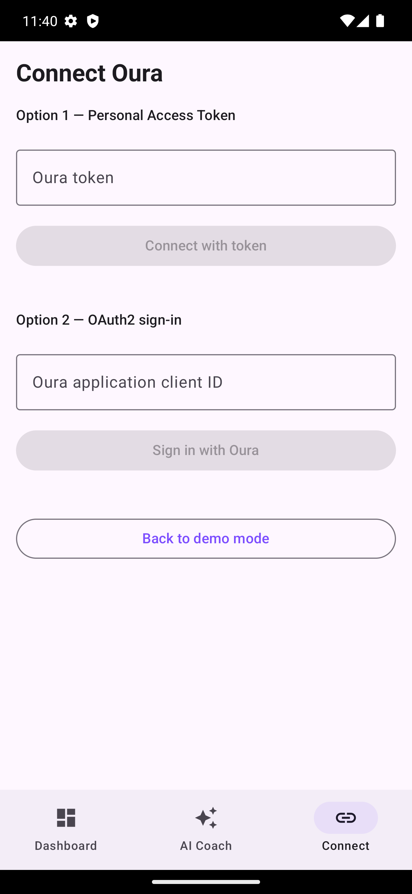
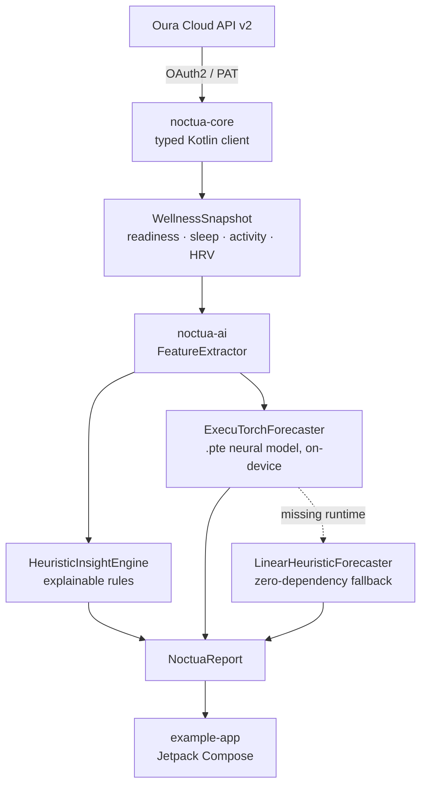

# 🦉 Noctua

**On-device AI wellness intelligence for Oura Ring — privacy-first Android SDK.**

Your ring already measures everything — readiness, sleep, HRV, temperature.
What the app doesn't do is *coach*: it hands you a score, never an answer to
"should I train hard today, or recover?" Getting that answer today means
pasting your biometrics into a cloud chatbot.

Noctua (the owl genus — nocturnal wisdom) closes that gap on-device. It's an
open-source Kotlin toolkit that combines a complete, typed client for the
**Oura API v2** with an **on-device AI layer** that turns raw biometrics into
explainable coaching insights and a next-day readiness forecast — **without
your health data ever leaving the phone**.

[](https://kotlinlang.org)
[](https://developer.android.com/jetpack/compose)
[](https://pytorch.org/executorch/)
[](LICENSE)

---

## Screenshots

| Dashboard | AI Coach (on-device) | Connect |
|:---:|:---:|:---:|
|  |  |  |

*Captured from the example app running in demo mode on a Pixel 7 Pro emulator.*

## Why Noctua?

Most wearable companion apps ship your biometric history to a cloud LLM to
generate "insights". Noctua takes the opposite stance:

| | Cloud AI companions | **Noctua** |
|---|---|---|
| Raw HRV / sleep / temperature data | uploaded to a server | **never leaves the device** |
| Insight logic | opaque | **transparent, unit-tested rules + open model** |
| Works offline | ✗ | **✓** |
| Latency | network round-trip | **< 5 ms on-device** |

## Architecture



| Module | What it is |
|---|---|
| **`noctua-core`** | Pure-Kotlin Oura API v2 client — OAuth2 helpers, auto-refreshing tokens, all `usercollection` endpoints, pagination, sandbox support. Runs on Android **and** any JVM backend. |
| **`noctua-ai`** | On-device intelligence: feature extraction (sleep debt, HRV z-score vs personal baseline, readiness trend), explainable heuristic insights, and a neural readiness forecaster bridged to **ExecuTorch**. |
| **`example-app`** | Material 3 Compose app — score rings, 14-day readiness trend, AI coach feed, OAuth/token connect flow, and a built-in **demo mode** that needs no Oura account. |
| **`model/`** | PyTorch → ExecuTorch export script for the readiness forecaster. |

## Quickstart

### 1. Get Oura credentials

- **Personal use:** create a Personal Access Token at
  [cloud.ouraring.com/personal-access-tokens](https://cloud.ouraring.com/personal-access-tokens)
  *(note: Oura has been moving new integrations to OAuth2)*.
- **Multi-user apps:** register an OAuth2 application at
  [cloud.ouraring.com/oauth/applications](https://cloud.ouraring.com/oauth/applications)
  with redirect URI `noctua://callback`.

### 2. Add the libraries

The modules are plain Gradle project dependencies (publish to Maven or use
via `includeBuild` / JitPack):

```kotlin
dependencies {
    implementation("com.noctua:noctua-core:0.1.0")
    implementation("com.noctua:noctua-ai:0.1.0")
    // Optional: enable the neural forecaster
    implementation("org.pytorch:executorch-android:1.0.0")
}
```

### 3. Fetch your data

```kotlin
val oura = OuraClient.Builder()
    .token("YOUR_TOKEN")
    .build()

// Coroutine-first; pagination is handled for you.
val readiness = oura.dailyReadiness(startDate = "2026-08-01", endDate = "2026-08-21")
val sleep     = oura.dailySleep(startDate = "2026-08-01", endDate = "2026-08-21")
val periods   = oura.sleep(startDate = "2026-08-01", endDate = "2026-08-21")
```

OAuth2 (client-side flow) in two lines:

```kotlin
val url = OuraOAuth.authorizationUrl(clientId, redirectUri = "myapp://callback")
// open `url` in a Custom Tab, then in your deep-link handler:
val token = OuraOAuth.parseClientSideRedirect(intent.dataString!!).accessToken
```

For long-lived apps, `OAuthTokenProvider` refreshes expiring tokens
automatically via Oura's `refresh_token` grant.

### 4. Generate on-device insights

```kotlin
val ai = NoctuaAI()
val report = ai.analyze(WellnessSnapshot(
    readiness = readiness,
    sleep = sleep,
    activity = oura.dailyActivity("2026-08-01", "2026-08-21"),
    sleepPeriods = periods,
))

println(report.forecastedReadiness)   // e.g. 74 — tomorrow's predicted score
report.insights.forEach { println("• ${it.title} (${it.confidence}%)") }
// • Sleep debt accumulating (88%)
// • HRV below your baseline (80%)
```

### 5. Go neural with ExecuTorch

The example app already bundles the ExecuTorch runtime
(`org.pytorch:executorch-android:1.4.0`) and the pre-exported
`readiness_forecaster.pte` — the forecast card literally shows
"neural · ExecuTorch" when the on-device model produced the prediction,
and "linear fallback" if the runtime were ever unavailable.

To export the model yourself (or retrain it):

```bash
cd model
pip install torch executorch
python export_readiness_forecaster.py   # → readiness_forecaster.pte
```

Ship the `.pte` with your app and swap the forecaster:

```kotlin
val ai = NoctuaAI(forecaster = ExecuTorchForecaster(pteFile.absolutePath))
```

If the ExecuTorch runtime or model file is absent, Noctua silently falls back
to the bundled linear model — the app never breaks.

📖 **Deep dive:** [docs/HOW_THE_AI_WORKS.md](docs/HOW_THE_AI_WORKS.md) traces
one real data point from Oura cloud to on-screen forecast — every formula and
every layer of the .pte execution stack.

## API coverage

| Endpoint | `OuraClient` method | Scope |
|---|---|---|
| `/v2/usercollection/personal_info` | `personalInfo()` | personal |
| `daily_sleep` / `daily_readiness` / `daily_activity` | `dailySleep()` · `dailyReadiness()` · `dailyActivity()` | daily |
| `daily_spo2` · `daily_stress` · `daily_resilience` | `dailySpo2()` · `dailyStress()` · `dailyResilience()` | spo2 / daily |
| `daily_cardiovascular_age` · `vO2_max` | `dailyCardiovascularAge()` · `vo2Max()` | heart_health |
| `sleep` (detailed periods) · `sleep_time` | `sleep()` · `sleepTime()` | daily |
| `heartrate` (time series) | `heartrate(start, end)` ISO-8601 datetimes | heartrate |
| `workout` · `session` · `tag` / `enhanced_tag` | `workouts()` · `sessions()` · `tags()` · `enhancedTags()` | workout / session / tag |
| `rest_mode_period` · `ring_configuration` | `restModePeriods()` · `ringConfigurations()` | daily / ring_configuration |
| Sandbox (`/v2/sandbox/...`) | `Builder().sandbox(true)` | none |

Errors map to typed `OuraException` subtypes: `Unauthorized`, `RateLimited`
(Oura allows ~5000 req / 5 min), `Http`, `Network`, `Serialization`.

## Run the example app

```bash
git clone https://github.com/RanjithRagavan/Noctua.git
cd Noctua
./gradlew :example-app:installDebug
```

The app boots into **demo mode** with a deterministic 21-day dataset, so you
can evaluate the full UX — score rings, trend chart, forecast card, AI coach —
before connecting a real ring. The [screenshots above](#screenshots) show
exactly what demo mode renders.

### Connect your own Oura account (optional)

1. Register an OAuth application at
   [developer.ouraring.com/applications](https://developer.ouraring.com/applications)
   with redirect URI `noctua://callback` (see `PRIVACY.md` / `TERMS.md` for the
   policy URLs the form asks for).
2. Add the client **ID** to `local.properties` (git-ignored):
   ```properties
   OURA_CLIENT_ID=YOUR_CLIENT_ID
   ```
   The Connect screen is prefilled from this via `BuildConfig`. Never put the
   client **secret** here — the client-side OAuth flow doesn't need it, and a
   secret embedded in an APK is not a secret.
3. Rebuild, open the **Connect** tab, tap **Sign in with Oura**.

## Roadmap

- [ ] On-device LLM sleep coach (ExecuTorch Llama runner, fully local chat)
- [ ] Personal fine-tuning loop: retrain the forecaster nightly on-device
- [ ] Health Connect write-back (share derived insights with Android Health)
- [ ] Webhook subscription helpers (`/v2/webhook/subscription`)
- [ ] Compose Multiplatform + iOS (KMP) port of `noctua-ai`

## Contributing

Issues and PRs welcome — see [CONTRIBUTING.md](CONTRIBUTING.md) for setup,
ground rules (privacy is the product), and good first contributions. The
heuristics in `HeuristicInsightEngine` are deliberately readable — improving
them with better evidence is a great first contribution. Run `./gradlew test`
before submitting.

## License

[MIT](LICENSE) — use it in personal or commercial apps.

*Noctua is an independent open-source project and is not affiliated with,
endorsed by, or sponsored by Ōura Health Oy.*
